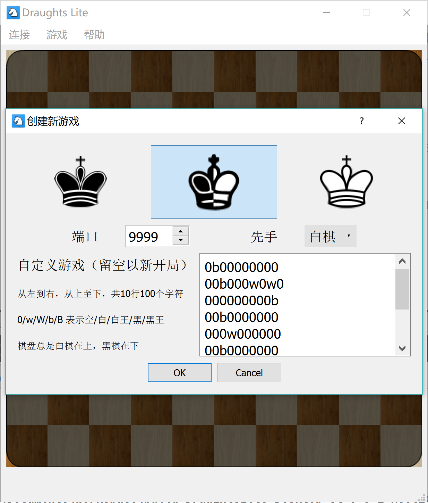
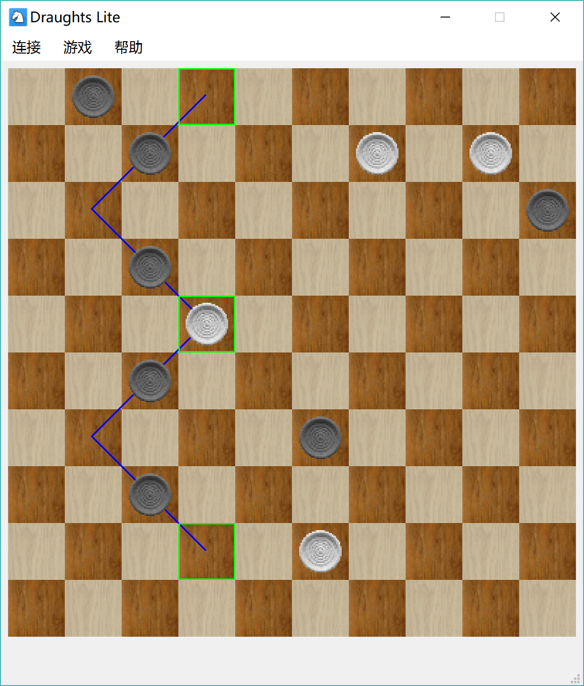
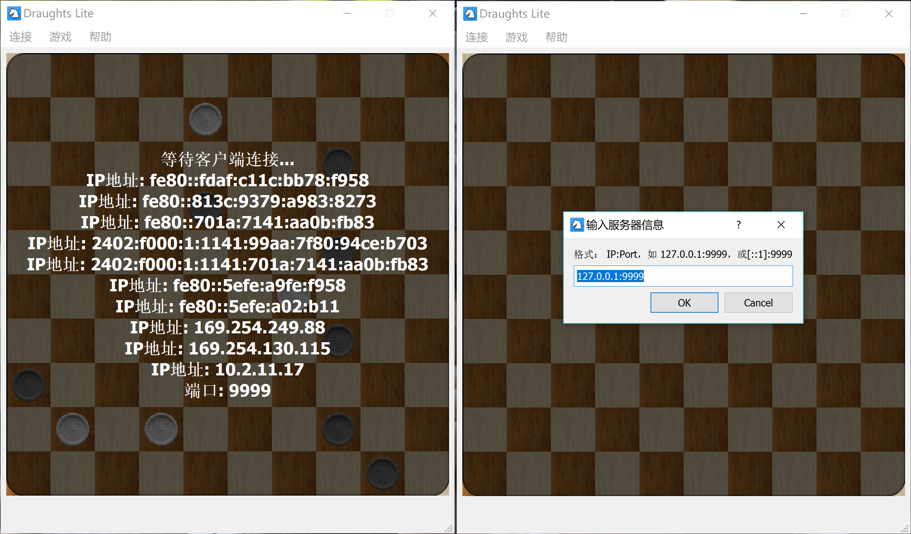

# DraughtsLite

DraughtsLite is a client-server draughts game in Qt. Assignment 2 of Programing and Training course, Tsinghua University, Summmer 2017.

This repository is not licensed. Use at your own risk.

## Building

Use `qmake` to build. Qt 5 and C++ 11 is required.

## Screenshots

New game:

In game:

Connect to server:

